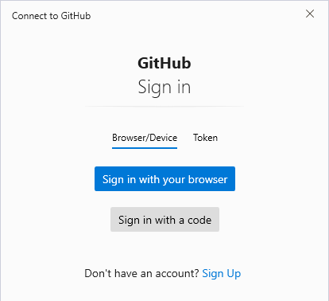
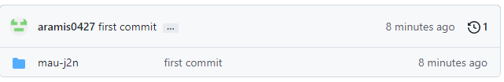
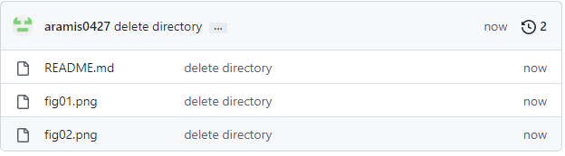

- git とは
分散型バージョン管理システムのこと。言い換えれば、ファイルのバージョン管理が簡単にできるツールである。
Gitを使ってファイルを管理すると、コンピューター上でファイルの編集履歴を管理できるので、編集前のファイルを残したまま、新しく編集したファイルを保存することができる。なので古いバージョンから新しいバージョンまでの管理が簡単になる。
プログラマーにとっては、多くのコードを編集した上で何か不具合が起きたときに、元のバージョンへ戻すことは日常茶飯事である。しかし、ひとつひとつコードの編集の度に古いバージョンの確認、作業を加えるようなことをすれば、時間はかかるしミスも増えてしまう。そういった作業を無駄なく、効率的に行うことができるのがGitの強みである。
https://tcd-theme.com/2019/12/what-is-git.html

- github とは
世界中の人々がプログラムコードやデザインデータを保存・公開できるソースコード管理サービスのこと。Gitはツールの名前で、GitHubはWebサービスの名前である。
GitHub上で、エンジニア各々が公開用のプログラムをアップして自分以外のエンジニアに共有したり、その後、履歴を残しながら更新したり、自分以外のエンジニアも修正を加えるということができる。
GitHubを使うためにはアカウントを作成する必要があるが、GitHubは企業や個人を問わずにベースとなる部分は無料で使うことができる。また、GitHubに作成されたリポジトリ（保存するスペース）は、基本的にすべて公開することになるが、指定したユーザーだけがアクセスできるプライベートリポジトリを作成することもできたりする。
https://www.modis.co.jp/candidate/insight/column_30

- markdown とは
markdownは文章構造を明示して書くことができる軽量マークアップ言語である。プレーンテキストで書いた文書からHTMLを生成するために、ジョン・グルーバーによって開発された。HTMLだけでなくパワーポイントやLaTeXなどに変換するソフトウェアも開発されている。
Stack Overflow、Redditといった掲示板サービスを筆頭に広く利用されている。サービスごとで基本の機能は共通している一方、独自の"方言"が存在する。そのため書き方がサービスごとに異なることで混乱を引き起こしたり、あるサービスでしか使えない機能があって不便であったりする。
基本的に使える機能として、見出し・文字装飾・URLリンク・引用・コードブロック・文字色・チェックリスト・箇条書きリスト・番号付きリスト・表・図の挿入・注釈・数式・絵文字がある。どれも文頭に記号を付け加えたり、文章を記号で囲んだりをするだけのため、プレーンテキストを読んでも可読性が高いという特徴がある。
https://www.markdown.jp/what-is-markdown/
https://notepm.jp/help/how-to-markdown
https://ja.wikipedia.org/wiki/Markdown

- 以降、作業ログ
- git インストール
https://git-scm.com/book/ja/v2/%E4%BD%BF%E3%81%84%E5%A7%8B%E3%82%81%E3%82%8B-Git%E3%81%AE%E3%82%A4%E3%83%B3%E3%82%B9%E3%83%88%E3%83%BC%E3%83%AB
- git セットアップ
- git の使い方
https://qiita.com/konweb/items/621722f67fdd8f86a017
    - git init
    - git add
    - git commit
    - git push

- githubアカウントの作成
https://qiita.com/ayatokura/items/9eabb7ae20752e6dc79d

- githubでリポジトリ(mau-j2n)を作る

- README.mdを作る

- 試しにcommitする
`git add *`
`git commit -m "initial commit"`
commitしようとしたらエラーが出た

```
Author identity unknown

*** Please tell me who you are.

Run

  git config --global user.email "you@example.com"
  git config --global user.name "Your Name"       

to set your account's default identity.
Omit --global to set the identity only in this repository.

fatal: unable to auto-detect email address (got 'solar@DESKTOP-3V9BKLL.(none)')
```
e-mailとnameを設定すればよさそう。
`git config --global user.email　"..........@gmail.com"`
`git config --global user.name "aramis0427"`

もう一度commitしてみる。
`git commit -m "initial commit"`
```
[main (root-commit) 5165500] initial commit
 1 file changed, 17 insertions(+)
 create mode 100644 README.md
```

`git push origin main`をやればよさそうだけど、originとは？
このサイトによると、originとしてリポジトリを紐づける必要がある https://qiita.com/Leonardom/items/5b94cd7e96a6fe87c6a4

`git remote add origin https://github.com/aramis0427/mau-j2n`

`git push -u origin main`

サインインが求められた


pushできてそうなので、githubで確認する。

- 誤ってディレクトリが作られてしまったから、修正する。



- 再度、pushする。
```
git add *
git commit -m "delete directory"
git push -u origin main
```

修正できた


- 課題1~3を追記して、再度pushする。
```
git add *
git commit -m "1st edit"
git push -u origin main
```